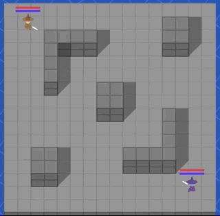

# Crowned Ultimate Wizard

Created for UCSC's Game AI class, Summer 2020
Created By:
* Zach Booth
* Nic Tee
* Joseph Silberman
* Xueer Zhu

An experiment to procedurally generate AIs using behavior trees using Love2D and Lua

Download an execulable version here:
https://groverburger.itch.io/crowned-ultimate-magician
